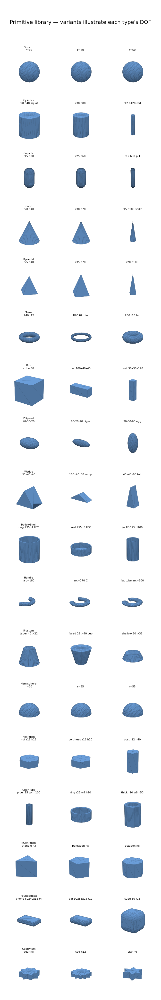
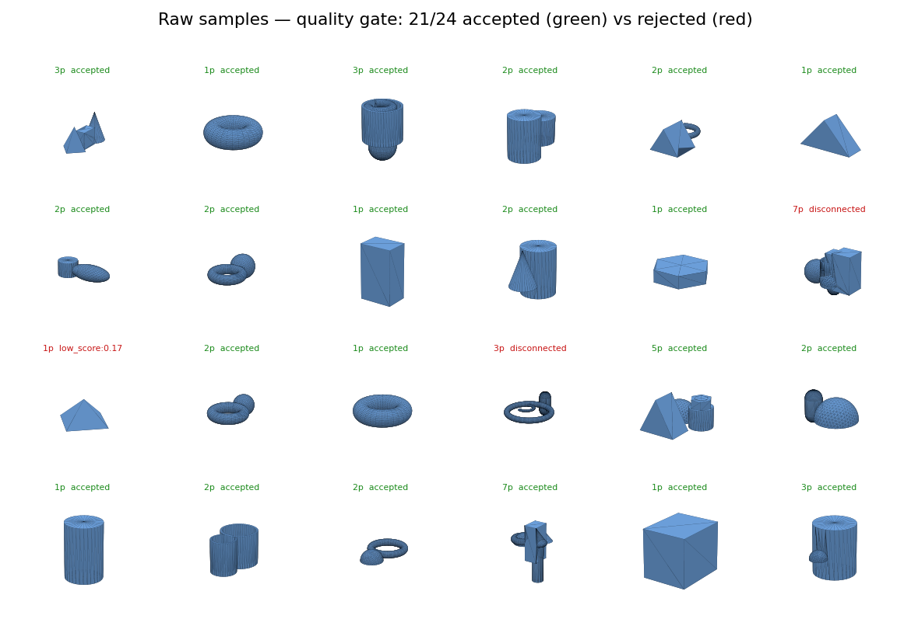
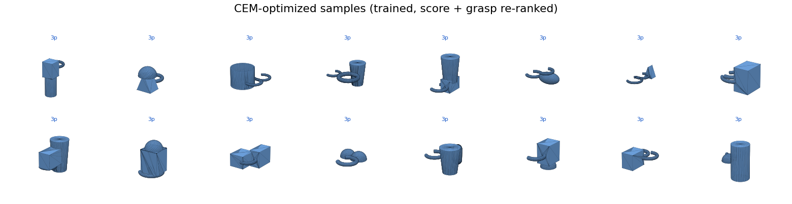
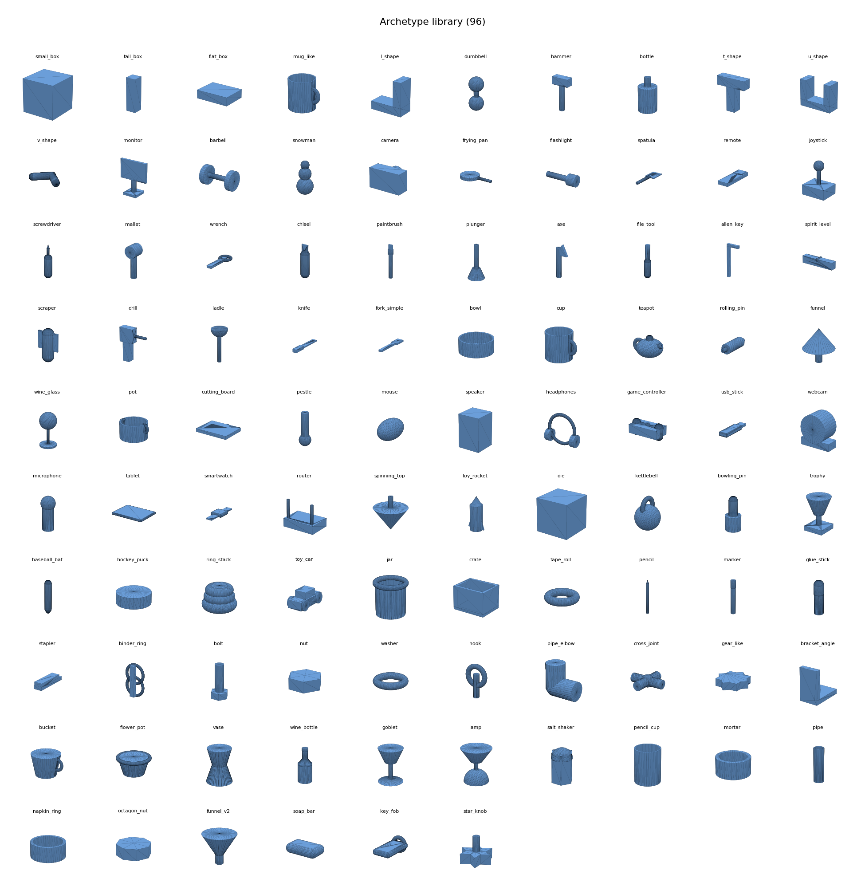
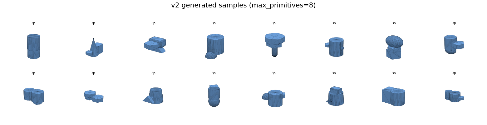

# Object gallery

Regenerate with (from `3d_generator/`):
`python scripts/render_gallery.py` · `python scripts/render_primitives.py` · `python scripts/render_samples.py`

See [`docs/PRIMITIVES.md`](../PRIMITIVES.md) for the full primitive reference,
parameters/DOF/math, the archetype **fidelity audit** (faked shapes → missing
primitives), and design sketches for proposed new primitives.

## Primitive library (`primitives.png`)

The 18 primitive types, each shown with 2–3 variants illustrating its degrees of
freedom (sphere = 1 DOF, box = 3 DOF).

## Generated samples (`samples_verdicts.png`, `samples_optimized.png`)

Raw samples tagged accepted (green) / rejected (red, with reason) by the quality
gate, and the cleaner CEM-optimized set. Shows how the solid-only primitive set
limits generation quality.

## Archetype library (`archetypes.png`)

All 96 hand-written archetypes in `ARCHETYPE_REGISTRY` (`src/archetypes.py`),
built from the 18 primitive types (box, cylinder, sphere, capsule, cone, pyramid,
torus, ellipsoid, wedge). Each is a single connected body.

## v2 generated samples (`v2_samples.png`)

Objects sampled from a trained v2 generator (`max_primitives=8`). Titles show
the primitive count per object — note the multi-part composites mixing several
primitive types, in contrast to v1's single-primitive output.

